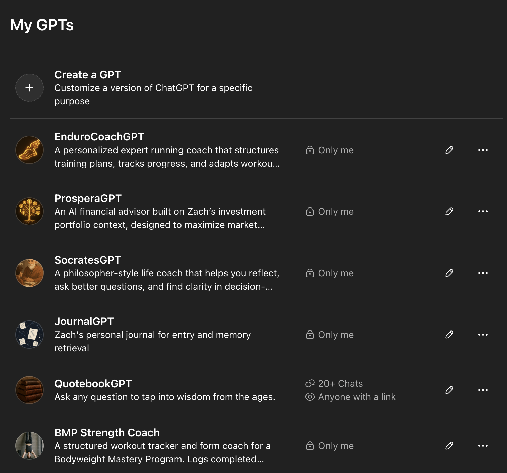

# GPTs Repository 🧠✨

Welcome to my personal collection of custom GPTs! This repository contains the recipes, instructions, and resources for building specialized AI assistants that help me manage personal knowledge, track progress, and explore insights.

*Overview of my personal GPTs collection - specialized AI assistants for personalized coaching and knowledge management.*

## 🎯 What This Is

Each GPT is designed around a specific domain of my life, from fitness tracking to journaling to quote collection.

## Current GPTs

### 📚 [QuotebookGPT](./quotebook-gpt/)
**Purpose:** Personal wisdom curator that helps recall insights from books, talks, and articles collected over time.

**What it does:**
- Searches your personal quote library stored in Google Sheets
- Uses vector search for semantic matching across topics, authors, and sources
- Lets you append new quotes directly to your inbox
- Prioritizes high-rated quotes while keeping results varied

**Tech stack:** Google Sheets + Custom Actions + Vector search

**Perfect for:** Anyone who wants to build a searchable personal knowledge base from their reading and learning.

---

### 📝 [Journal GPT](./journal-gpt/)
**Purpose:** Intelligent journaling assistant that captures, refines, and retrieves personal entries with temporal context.

**What it does:**
- Captures raw journal entries and lightly refines for clarity
- Stores entries with exact dates and computed weekly labels
- Retrieves entries using hybrid search (JSONL + GPT memory)
- Compiles entries by week, month, or year on request

**Tech stack:** JSONL storage + Hybrid retrieval + Temporal indexing

**Perfect for:** Building a searchable personal history with natural language queries like "Show me key memories about Halloween across the years."

---

### 💪 [Fitness Quest Coach](./fitness-quest-coach/)
**Purpose:** Gamified fitness mentor that guides users through progressive workout quests with structured progression.

**What it does:**
- Guides users through progressive workout levels (currently Handstand Push-Up Quest)
- Tracks progress and provides step-by-step instructions
- Includes video links, quick tips, and form guidance
- Generates exportable workout summaries for Strava/journaling

**Tech stack:** JSON workout database + Progress tracking + Gamification mechanics

**Perfect for:** Creating structured, progressive fitness programs that feel like RPG quests.

---

## 🧪 The Experiment

These GPTs represent my approach to **personal AI systems** - building specialized assistants that:

1. **Add automation and insight to real workflows** I face weekly
2. **Integrate with existing tools** (Google Sheets, Strava, personal journals)
3. **Provide structured outputs** that fit into my workflows
4. **Learn and adapt** to my preferences over time

## 🎨 Design Philosophy

### Personal Knowledge Management
- **Searchable:** Everything is queryable with natural language
- **Temporal:** Time-aware storage and retrieval
- **Structured:** Consistent data models for reliable outputs
- **Integrated:** Works with tools I already use

### AI-First Design
- **Specialized:** Each GPT has a focused domain and purpose
- **Recipe-driven:** Clear system prompts that define behavior
- **Memory-aware:** Leverages GPT memory for context and learning
- **Action-enabled:** Integrates with external APIs when needed

## 🚧 More to Come

This repository is actively growing as I plan to document my remaining GPTs and build more specialized GPTs.

## 🔧 Building Your Own

Each GPT includes:
- **Detailed instructions/recipe** for the system prompt
- **Example interactions** showing how to use it
- **Technical setup** for integrations and actions

Feel free to remix these for your own needs. The goal is to show how anyone can build personal AI systems that actually improve their daily life.

## 🌐 Connect & Learn More

- **Website:** [aiwithzach.com](https://aiwithzach.com) - My main AI lab and blog
- **YouTube:** [@ai-with-zach](https://youtube.com/@ai-with-zach) - Video tutorials and demos
- **LinkedIn:** [Zach Stanford](https://www.linkedin.com/in/zachstanford1/) - Professional updates

## 📄 License

This project is meant as a **personal knowledge tool template**. Feel free to adapt it for your own use.

---
